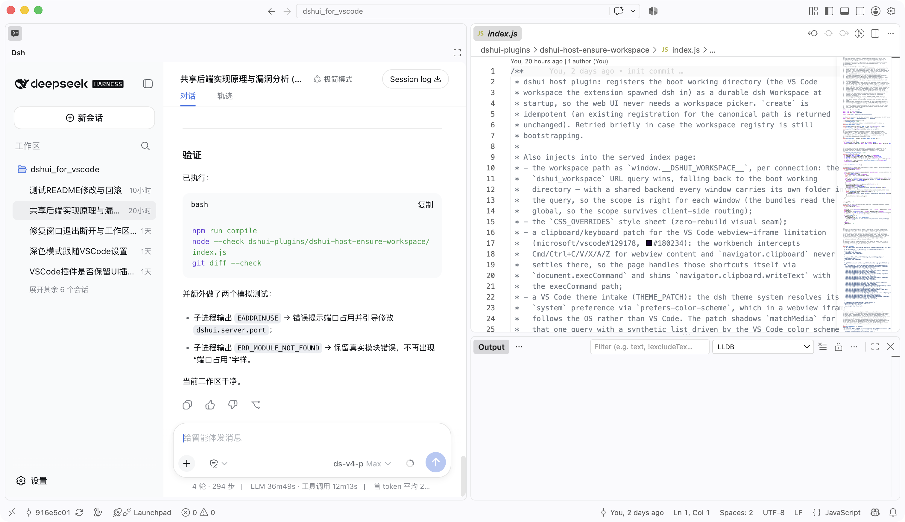

# dsh UI for VS Code

> 中文 · [English](README.en.md)

## 目录

- [简介](#简介)
- [特性](#特性)
- [环境要求](#环境要求)
- [安装](#安装)
- [快速开始](#快速开始)
  - [命令](#命令)
  - [设置](#设置)
  - [引用文件与代码片段](#引用文件与代码片段)
  - [文件打开](#文件打开)
  - [消息里的网络链接](#消息里的网络链接)
  - [多窗口（共享后端）](#多窗口共享后端)
- [工作原理](#工作原理)
- [开发流程](#开发流程)
  - [三级迭代，按需选择](#三级迭代按需选择)
  - [跟随 dsh 版本升级](#跟随-dsh-版本升级)
- [注意事项](#注意事项)
- [贡献](#贡献)
- [反馈](#反馈)
- [许可证](#许可证)

## 简介

[dsh UI for VS Code](https://github.com/leathong/dshui-for-vscode) 是一个 VS Code 扩展，将
[DeepSeek Harness](https://github.com/deepseek-ai/deepseek-harness)（`dsh`，DeepSeek 开源的
agentic coding 框架，主张「一切皆插件」）的 Web UI 嵌入 VS Code 侧边栏，让 agent 会话与代码工作流
同处一个窗口。

核心思路：**你在 VS Code 中打开的文件夹就是 dsh 的工作区**。扩展以该文件夹为工作目录启动内嵌的
`dsh web` 服务器（随包内置 CLI 运行时，无需单独安装 Node），并将其注册为持久化 dsh Workspace。
会话聊天、工具卡片、goal、subagent、后台任务等 dsh 能力原样可用，同时获得与 VS Code 深度集成的体验。

<p align="center">
  
  <br>
  <em>dsh UI 嵌入 VS Code 侧边栏：打开的文件夹即工作区，输入框常驻底部，侧边栏只列出当前工作区的会话。</em>
</p>

## 特性

与原版浏览器 UI 相比，本扩展主要有四处差异：

1. **无需选择工作区**。打开的文件夹即工作区：扩展以其为工作目录启动 `dsh web` 服务器并注册为
   持久化 Workspace，视图打开即有一个可用会话。
2. **侧边栏仅列出当前工作区的会话**。其他工作区、Ungrouped 桶、分组/排序等视图选项均被隐藏，
   所见即当前文件夹。
3. **输入框常驻底部**。移除居中的「新会话」hero，composer 在任意状态下都固定在底部。
4. **会话菜单为「删除」而非「归档」**。删除操作由扩展宿主经 VS Code 文件 API 直接移除
   `~/.dsh/sessions/...` 下的会话日志（不经 dsh 的归档 RPC，dsh 自身行为不变）。

此外，dsh Web UI 的其余能力完整保留：会话聊天、工具卡片、goal、subagent、设置、模型选择、后台
任务、反馈等。扩展还提供若干 VS Code 深度集成：

- **主题跟随**：webview 内的 `prefers-color-scheme` 跟随 VS Code 主题而非操作系统，外观设置中的
  system 偏好解析为「跟随 VS Code 主题」；手动选择深色/浅色仍然优先。在系统浏览器中打开时仍跟随
  操作系统。
- **文件打开**：聊天中的文件链接在**当前 VS Code** 中打开，全程无系统确认弹窗（详见
  [文件打开](#文件打开)）。
- **引用文件与代码片段**：右键即可把文件引用或选中代码插入输入框（详见
  [引用文件与代码片段](#引用文件与代码片段)）。
- **多窗口共享后端**：所有窗口复用同一个内嵌服务器，无端口冲突，会话数据一致（详见
  [多窗口（共享后端）](#多窗口共享后端)）。

## 环境要求

- VS Code ≥ 1.85
- 无需单独安装 Node：扩展使用扩展宿主内置的 Node（`ELECTRON_RUN_AS_NODE`）运行 dsh CLI。
- 仅当需要**从源码重建客户端 bundle** 时才需要本机 Node ≥ 22.19 与 pnpm 11.7.0（见
  [开发流程](#开发流程)）。

## 安装

**方式一：安装现成安装包**（推荐；内置 dsh 运行时，约 60 MB）

安装包随 [GitHub Releases](https://github.com/leathong/dshui-for-vscode/releases) 发布：

```sh
code --install-extension dshui-for-vscode-0.1.0.vsix
```

**方式二：从源码打包**

```sh
npm install
npm run compile                       # TypeScript → out/
npx @vscode/vsce package              # 产出 dshui-for-vscode-<version>.vsix
```

> 从源码打包**不需要**上游源码：`.dsh-src/` 与 `.tools/` 不入库，全新克隆中不存在；
> `scripts/copy-clients.mjs` 在检出缺失时会自动跳过，使用随包提交的预编译客户端 bundle。

开发调试：按 **F5**（仓库自带 `.vscode/launch.json`），或运行
`code --extensionDevelopmentPath="$PWD" <文件夹>`。

## 快速开始

1. 安装扩展（`dshui-for-vscode`）。
2. 打开一个文件夹——该文件夹即成为 dsh 工作区。
3. 侧边栏出现 dsh UI（活动栏图标 → **dsh**）；打开文件夹时自动显示（可用 `dshui.autoOpen` 关闭，
   用 **dsh UI: Open** 命令重新打开）。
4. 在底部输入框直接使用。会话按文件夹持久化在 dsh home（`~/.dsh`，与浏览器 UI 共用）。

### 命令

| 命令 | 说明 |
| --- | --- |
| `dshui.open` | 显示侧边栏 dsh UI 视图 |
| `dshui.openInBrowser` | 在系统浏览器中打开同一个 scoped 服务器 |
| `dshui.referenceFile` | 将文件引用插入 dsh 输入框（资源管理器 / 编辑器 / 编辑器标签页右键菜单） |
| `dshui.referenceSelection` | 将选中代码片段（含行号）插入 dsh 输入框（编辑器右键菜单） |
| `dshui.restartServer` | 重启内嵌 dsh 服务器并刷新侧边栏视图（仅命令面板调用，无视图按钮以防误触；服务器未运行时等同启动） |

> 重启服务器会中断正在进行的 agent 任务（会话数据持久化于 `~/.dsh`，不会丢失）。共享后端下若
> 服务器由**另一个窗口**启动，会先弹出确认框说明对其他窗口的影响；确认后本窗口接管：终止原监听
> 进程并在同一端口重新拉起成为新 owner，其他窗口 URL 不变，重载后自动恢复。修改 `dshui.server.port`
> 等设置后可用该命令立即生效，无需重载窗口。

### 设置

| 设置 | 默认 | 说明 |
| --- | --- | --- |
| `dshui.autoOpen` | `true` | 打开文件夹时自动显示侧边栏视图 |
| `dshui.server.port` | `61370` | 内嵌服务器端口。固定端口兼作共享后端会合点：所有窗口复用同一个服务器（各按 `?dshui_workspace` 作用域），同一 origin 使 localStorage（含上次打开的会话）跨启动恢复；设为 `0` 则由系统分配（无共享、无保持）。端口被占用时自动退回随机端口 |
| `dshui.openFilesInVscode` | `true` | 聊天中的文件链接在**当前 VS Code** 中打开（经扩展内桥接，无系统弹窗），而非系统默认编辑器 |
| `dshui.checkDshUpdates` | `true` | 启动时异步查询 npm 上的最新 dsh 版本，内置版本过旧时通知（24 小时节流，同一新版本仅提示一次；可关闭） |

### 引用文件与代码片段

在**资源管理器**中右键文件、或在**编辑器标签页**上右键 → **Reference File**；在**编辑器**
中选中代码后右键 → **Reference Selection**。引用以消息文本插入侧边栏输入框（自动聚焦侧边栏
视图）：

- 文件引用：`[src/extension.ts](src/extension.ts)`——标准 markdown 链接（相对路径），智能体以自带
  工具读取，不占用输入框体积；
- 代码片段引用：`[src/extension.ts#L10-L20](src/extension.ts#L10-L20)` + 代码块——路径、行号
  （GitHub 风格 `#Lx-Ly` 锚点）与选中代码一并提供给智能体；超长选中（> 20,000 字符）会截断并附注
  完整路径。

引用在面板未就绪（启动中）时不会丢失：webview 外壳先缓冲，dsh SPA 就绪后自动写入草稿；输入框
忙碌（正在提交）时会等待其可写后再插入。

### 文件打开

聊天中的文件链接默认在**当前 VS Code** 中打开，且**无系统确认弹窗**：

- 扩展内置一个本机 HTTP 桥（127.0.0.1 随机端口，随扩展生命周期启停），对 api-proxy 应用幂等小
  补丁，把「打开文件」请求转交该桥，由扩展经 **VS Code API** 打开文件；
- 共享后端下每个窗口将自己的工作区与桥登记到 `$DSH_HOME/dshui-bridges.json`，补丁按「打开路径所属
  工作区（最长前缀）」路由到**点击文件的窗口**的桥；工作区外路径、同目录多窗口等边界场景退回
  owner 的桥；
- 桥不可用时依次回退：`code` CLI（应用内路径经 `DSHUI_CODE_CLI` 传给服务器，走 CLI socket 协议
  打开正在运行的 VS Code，同样无确认弹窗）→ `open vscode://file/...`（带确认弹窗）；
- `.html` / `.pdf` 仍走系统浏览器打开；可用 `dshui.openFilesInVscode` 关闭（恢复系统默认程序）。

### 消息里的网络链接

聊天消息里的 **http/https 链接**（含 `mailto:`）默认在**系统浏览器**中打开。dsh 把这类链接渲染成
`<a target="_blank">`，在普通浏览器里会开新标签页，但 VS Code webview 会拦截 `window.open`/弹窗，
点击原本无反应——host 插件注入的捕获阶段点击拦截器把这类链接改为：点击 → 经 webview 外壳转发给
扩展宿主 → `vscode.env.openExternal` 打开系统浏览器。修饰键点击（Cmd/Ctrl/Shift/Alt+点击）放行给
VS Code 自身处理；非 http(s) 目的地（如 `javascript:`）不做拦截。

### 多窗口（共享后端）

固定端口（默认 61370）兼作会合点：第二个窗口激活时探测该端口，发现已有 dshui 服务器则直接复用
（不再拉起新进程），并将自己的文件夹经 `$DSH_HOME/dshui-workspaces/` 的 marker 注册进共享服务器，
webview 以 `?dshui_workspace=<folder>` 连接，host 插件按连接解析作用域。生命周期：
`$DSH_HOME/dshui-server.json` 记录使用窗口的 pid，服务器 detached 启动（可存活于启动它的窗口之外），
host 插件轮询注册表，无存活窗口时自行退出。由此，同一或不同工作区的窗口共享一个后端，`~/.dsh`
始终只有一个进程写入，不再有 EADDRINUSE 冲突，也规避了 dsh 上游 README 关于多进程共享磁盘状态的
警告。

注意事项：

- **文件打开**：各窗口登记自己的桥（`dshui-bridges.json`，按 pid 探活清理），补丁按打开路径的
  工作区前缀路由——文件在哪个窗口的工作区下，就在**那个窗口**打开。边界场景退回 owner 的桥：
  文件不在任何已登记工作区下（如 `/tmp/...`）、或两个窗口打开同一文件夹（无法区分，取最近登记的）。
  owner 关闭后桥不可用，回退 `code` CLI（在**最近聚焦**的 VS Code 窗口打开，无确认弹窗），再退回
  `vscode://file`（带确认弹窗）。
- **localStorage 同源共享**：多窗口并存期间，`dsh.sessions.current` 等浏览器端状态互相可见；
  跨工作区时恢复校验失败会自然回退空白会话（不会误开其他会话），「恢复上次会话」在并存期间降级，
  单窗口使用不受影响。
- 共享仅在固定端口（默认）下生效；`dshui.server.port = 0` 时每个窗口各起一个随机端口服务器。

## 工作原理

```
VS Code 侧边栏视图（webview）
  └── <iframe src="http://127.0.0.1:<port>">     ← 原版 dsh SPA（独立浏览器语义）
        └── 经 /api 与扩展拉起的 dsh 服务器通信
```

- **服务器**：扩展将真实的 `@deepseek-ai/dsh` CLI 作为运行时依赖打包，以打开的文件夹为 cwd 启动
  `dsh --profile web`（端口见 `dshui.server.port`，默认固定 61370；启动时预启动，避免视图加载时的
  空白）。
- **启动恢复上次会话**：固定端口复用同一 origin，客户端将当前会话写入 localStorage
  （`dsh.sessions.current`），下次启动原生恢复——打开的就是上次最后使用的会话；无历史会话时退回
  空白新会话。端口被占用时自动退回随机端口（该次无保持）。
- **插件装载**：激活时把三个 dshui 插件装入 `$DSH_HOME/profiles/node_modules`（同时装入扩展自身
  `node_modules` 作为 loader 回退），并经 `--patch` 覆盖层接入（见 `patch.yml`）：
  - `dshui-host-ensure-workspace`——host 插件：启动时把工作目录注册为 Workspace，并向页面注入
    `window.__DSHUI_WORKSPACE__`（scope 路径）、`CSS_OVERRIDES` 免重建样式覆盖层（含字号收敛）、
    VS Code 主题接管补丁（影子 `matchMedia`，详见本节「主题跟随」）、Cmd/Ctrl+C 复制
    处理器（VS Code webview 会拦截 iframe 内的复制快捷键，见
    [microsoft/vscode#129178](https://github.com/microsoft/vscode/issues/129178) 与
    [microsoft/vscode#180234](https://github.com/microsoft/vscode/issues/180234)）、Cmd/Ctrl+N 新建
    会话处理器（拦截 workbench 的「新窗口」快捷键，改走侧边栏「新建会话」按钮），以及文件/代码
    引用写入处理器（接收扩展右键菜单经 webview 外壳转发的引用消息，写入 composer 草稿）；
  - `dshui-client-ui-workspace` / `dshui-client-ui-conversation`——两个原版客户端包的**重新构建产物**，
    内含侧边栏过滤、底部输入框改动与「删除会话」菜单（删除经 webview 外壳 → 扩展宿主以 VS Code
    文件 API 完成）。
- **删除会话**：dsh 本身只有「归档」（隐藏会话、不删文件），没有删除 RPC。插件将会话行菜单的
  「归档会话」改为「删除会话」：点击后插件向 webview 外壳 postMessage（`dshui:deleteSession`，
  携带会话 id 与其工作区目录），外壳转发给扩展宿主；宿主按 dsh 的会话路径规则
  （`$DSH_HOME/sessions/<工作区目录编码>/<会话 id>/`，与 `dsh-session-persistence-jsonl` 的
  `projectKey`/`encodeSegment` 一致）定位会话目录，用 **VS Code 文件 API**
  （`vscode.workspace.fs.delete`，递归）删除其日志文件，再经外壳回传结果
  （`dshui:sessionDeleted`）；插件收到确认后隐藏该行（下次 `session.list` 重拉时该会话已不存在），
  若删除的是当前会话则回到「新会话」视图。非 VS Code 环境（如在系统浏览器中打开）或宿主无响应
  （15 秒超时）时删除失败并保留该行。
- **主题跟随**：webview iframe 内的 `prefers-color-scheme` 本跟随操作系统，与 VS Code 主题
  （`workbench.colorTheme`）可能不一致。扩展在每次视图加载与主题切换时把当前配色方案
  （Dark/HighContrast → 深色，其余 → 浅色）经外壳与 URL 参数 `dshui_theme` 传给 SPA，host 插件
  注入的补丁以影子 `matchMedia` 接管该查询——外观设置中的 **system** 偏好因此解析为「跟随 VS Code
  主题」而非操作系统；手动选择深色/浅色仍然优先。在系统浏览器中打开（`dshui.openInBrowser`）不带
  该参数，仍跟随操作系统。

## 开发流程

### 三级迭代，按需选择

webview 渲染的是**原版 dsh SPA**（deepseek-harness 仓库的上游代码）；侧边栏/输入框的改动不在
上游，而是集中在两个「客户端插件 bundle」中——它们由上游客户端包重新构建并注入 dshui 改动，
随扩展分发**预编译产物**（`dshui-plugins/`），由 dsh 服务器从已安装包加载。

对上游客户端源码的改动以补丁形式随仓库发布：`patches/dshui-client-bundles.patch`（15 个文件，
覆盖 `ui-workspace` / `ui-conversation` 及其测试；基提交固定，应用步骤见 `patches/README.md`）。
上游源码（`.dsh-src`）与构建工具（`.tools/`）**不提交到 git**。

| 改什么 | 改哪里 | 需要重建？ |
| --- | --- | --- |
| 扩展逻辑（服务器、webview、命令、设置） | `src/*.ts` | `npm run compile` 后 F5 |
| **视觉调整**（间距、颜色、贴底、隐藏元素） | `dshui-plugins/dshui-host-ensure-workspace/index.js` → `CSS_OVERRIDES` 列表 | **无需**——重载窗口即可 |
| 客户端行为（过滤、hero 流程、组件逻辑） | `.dsh-src/packages/client/ui-workspace` / `ui-conversation`（TypeScript，需先按 `patches/README.md` 获取源码） | 完整客户端重建（见下） |

修改 `dshui-host-ensure-workspace/index.js` 中注入页面的浏览器脚本（引用写入 / 主题接管）后，可先
运行自带的行为冒烟测试再重载窗口：

```sh
node scripts/check-reference-patch.mjs && node scripts/test-reference-patch.mjs
node scripts/check-theme-patch.mjs && node scripts/test-theme-patch.mjs
```

日常修改扩展逻辑或样式**不需要**源码检出；仅结构性修改 dsh 客户端代码才需要完整重建：

```sh
# 0. 获取上游源码并应用 dshui 补丁（源码不入库；基提交与完整命令见 patches/README.md）
git clone https://github.com/deepseek-ai/deepseek-harness.git .dsh-src
cd .dsh-src
git fetch origin <patches/README.md 中的基提交> && git checkout FETCH_HEAD
git apply ../patches/dshui-client-bundles.patch   # 基提交不匹配会安全失败
cd ..

# 1. 从源码构建改过的客户端 bundle
cd .dsh-src
pnpm install                      # 需要 pnpm 11.7.0、Node ^22.19 || >=24
pnpm run build:lib:host           # 生成共享 /remote 模块
pnpm run build:lib:client         # 编译并打包全部客户端包
cd ..

# 2. 把新 bundle 拷入扩展插件包
node scripts/copy-clients.mjs

# 3. 编译扩展并启动 Extension Development Host
npm run compile
code --extensionDevelopmentPath="$PWD" <文件夹>
```

> `.dsh-src/`（约 1.6 GB）与 `.tools/` 不提交到 git，仅在需要重建客户端 bundle 时按
> `patches/README.md` 获取，用完可随时删除——运行时读取的是 `dshui-plugins/` 中的预编译产物。
> 删除后失去的仅是「再次修改客户端行为」的能力。

### 跟随 dsh 版本升级

插件启动时会异步对比 npm 上的最新 `@deepseek-ai/dsh` 与内置版本（`dshui.checkDshUpdates` 控制，
默认开启；24 小时节流、同一新版本仅提示一次），内置版本过旧时通知——但提示仅为引导，升级仍需按
以下完整流程手动重打包安装插件。

扩展把两处 dsh 版本绑定在一起，升级时需要一起对齐：

1. **CLI 运行时**：`package.json` 的 `dependencies["@deepseek-ai/dsh"]`（当前 `0.1.0-rc.6`）。
2. **客户端 bundle 的源码**：`.dsh-src` 检出（当前对应 rc.6 发布的相近提交；由于仓库 master 可能
   落后于 npm 发布，对齐方式是查看各包 `package.json` 的版本号，并以实际运行测试为准）。

升级步骤：

```sh
# 0. （可选）重新检出与目标版本对齐的源码——基提交固定为 patches/README.md 中的值
#    git clone https://github.com/deepseek-ai/deepseek-harness.git .dsh-src
#    cd .dsh-src && git fetch origin <基提交> && git checkout FETCH_HEAD && git apply ../patches/dshui-client-bundles.patch

# 1. 升级内置 CLI
npm install @deepseek-ai/dsh@<新版本>

# 2. 检查补丁是否仍完整——核心一步
node scripts/verify-patches.mjs      # 逐个标记缺失即说明该文件需要重新套用补丁
#    改动已固化为 patches/dshui-client-bundles.patch：对基提交能干净应用则直接使用；
#    出现漂移则按步骤 3 的清单重套，并重新导出：
#    git -C .dsh-src diff > patches/dshui-client-bundles.patch

# 3. 缺失的补丁按以下清单重新套用（改动都很小，按文件内注释即可）
#    - ui-workspace/src/client/tree.ts                 加 scopedWorkspacePath 与各 derive 的 scope 参数与 deletedSessionIds
#    - ui-workspace/src/client/WorkspaceBrowser.tsx    SCOPE 常量、workspaces/ungrouped 过滤、隐藏添加/视图选项、rail 隐藏 sectionHeader、会话删除行隐藏
#    - ui-workspace/src/client/contract/slots.ts       archiveSession 改为 deleteSession
#    - ui-workspace/src/client/index.ts                会话删除：postMessage 请扩展宿主删除日志文件（含 15s 超时与监听器清理）
#    - ui-workspace/src/client/rows/Rows.tsx           会话菜单「删除会话」（垃圾桶图标、danger 样式）、onArchive 改为 onDelete
#    - ui-workspace/src/client/locales.ts              menu.archiveSession 改为 menu.deleteSession
#    - ui-workspace/tsdown.config.ts                   bundle id 改为 dshui-client-ui-workspace
#    - ui-workspace/tests/{rows,workspace-browser,tree}.client.spec.*  会话删除相关测试
#    - ui-conversation/.../ConversationRoot.tsx        SCOPE 常量、静态 chip、hero 隐藏、data-dshui-scope
#    - ui-conversation/.../EmptyHero.tsx               WorkspaceChip 的 staticChip prop
#    - ui-conversation/.../ConversationRoot.module.css  scoped hero 贴底
#    - ui-conversation/.../HeroShell.module.css        .workspaceStatic
#    - ui-conversation/tsdown.config.ts                bundle id 改为 dshui-client-ui-conversation

# 4. 重建并拷入
pnpm run build:lib:host && pnpm run build:lib:client   # 在 .dsh-src 内
node scripts/copy-clients.mjs

# 5. 重新编译扩展并打包
npm run compile && npx @vscode/vsce package
```

其他随版本漂移的风险点（升级后应逐项检查）：

- **`src/openPatch.ts`**（配合 `src/openBridge.ts`）：补丁定位的是 api-proxy 内原版 darwin 打开分支
  的字符串，并依赖服务器环境变量 `DSHUI_OPEN_ENDPOINT`（扩展启动桥时注入）与 `DSHUI_CODE_CLI`
  （应用内 `code` CLI 路径，桥不可用时的回退）。dsh 若修改该段代码，补丁会安全跳过并记录日志
  （`file opener patch: ... skipping`）——此时按新代码重新编写分支字符串即可；桥接不可用时会自动
  回退 `vscode://file`。
- **`patch.yml`**：覆盖的行 id（`ui-workspace` / `ui-conversation`）与插入的
  `dshui-host-ensure-workspace` 依赖 `web-app` bundle 中的行名与 `workspaceRegistry` / `webServer`
  服务名；这些若有变化，需同步更新。
- **`dshui-plugins/*/package.json`**：`dsh.client.inject` 列表仅为信息性依赖边，一般无需改动。
- **数据兼容**：dsh 处于预发布（rc）阶段，升级可能改变持久化格式（`~/.dsh` 下的
  sessions/storages）。升级前留意 release 说明；必要时备份 `~/.dsh`。

## 注意事项

- 内嵌服务器与浏览器 UI 共用 `~/.dsh`。**不要同时运行浏览器 UI 与扩展**——dsh 磁盘状态不是多进程
  安全的。

## 贡献

欢迎提交 issue 与 pull request：

- 报告缺陷或功能建议：请附上 VS Code 版本、扩展版本、操作系统与复现步骤。
- 开发相关细节（补丁、构建、测试）参见[开发流程](#开发流程)。
- 欢迎补充使用截图与文档改进。

## 反馈

- 问题跟踪：[GitHub Issues](https://github.com/leathong/dshui-for-vscode/issues)
- 上游项目：[deepseek-harness](https://github.com/deepseek-ai/deepseek-harness)

## 许可证

[MIT](LICENSE)。上游 [deepseek-harness](https://github.com/deepseek-ai/deepseek-harness) 亦为
MIT 协议。
